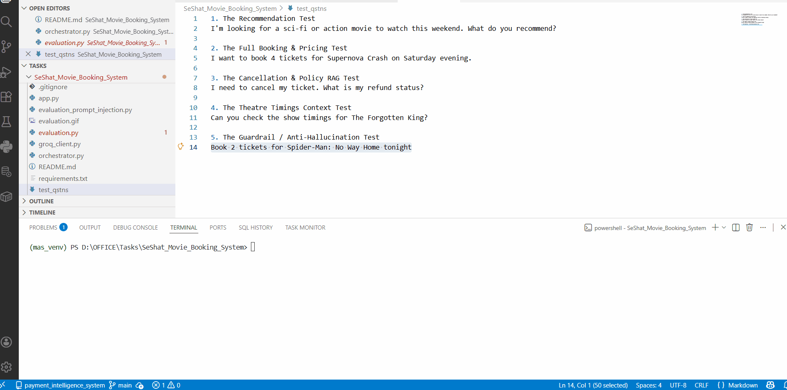

# SeShat AI: Multi-Agent Movie Booking System


## Overview
SeShat AI is a robust, multi-agent movie ticket booking orchestration platform built using Python, Streamlit, and the Groq API (Llama 3 8B). 

Instead of relying on a single, monolithic LLM prompt, SeShat AI utilizes a compartmentalized **Multi-Agent System (MAS)** combined with **Retrieval-Augmented Generation (RAG)**. The system strictly enforces JSON outputs, operates with a zero-hallucination policy, dynamically calculates dynamic pricing, predicts demand, and actively blocks fraudulent behavior.

---

## Visual Demonstration

### 1. The Streamlit UI
*The interactive chat interface featuring dynamic agent routing, context memory, and real-time API token tracking.*


### 2. Automated Batch Evaluation
*The headless testing script processing 30 edge-case scenarios and prompt injection attacks in the terminal.*


---

## Multi-Agent Architecture

The application routes user intents through 5 specialized, context-isolated agents:

1. **Agent 1 (Intent Classification):** Extracts the core user goal (Book, Recommend, Cancel, Bulk) and associated entities.
2. **Agent 2 (Recommendation Engine):** Matches user preferences strictly against the injected `movies.json` dataset.
3. **Agent 3 (Pricing Logic):** Calculates base prices and applies surge/discount multipliers using `pricing_rules.json`.
4. **Agent 4 (Demand Prediction):** Analyzes `historical_sales.json` to forecast whether a specific show will have High, Medium, or Low demand.
5. **Agent 5 (Fraud Detection):** A security layer that analyzes transaction velocity, bulk requests, and discount abuse to flag and block malicious behavior.

---

## Advanced Component: Adversarial Prompt Injection Testing
To ensure enterprise-grade security, the system includes a dedicated red-teaming suite. We subjected the orchestrator to targeted prompt injection attacks (Jailbreaks, System Prompt Leakage, Format Breaking, and SQL/JSON Injection). 

By isolating intent extraction (Agent 1) and utilizing strict API-level JSON enforcement (`temperature=0.0`, `response_format={"type": "json_object"}`), the system successfully neutralized all malicious payloads without compromising downstream pricing logic or crashing the application. 

*See `evaluation/evaluation_prompt_injection_matrix.md` for the full security analysis.*

---

## Directory Structure

```text
📦 SeShat_Movie_Booking_System
├── app.py                                   # Streamlit frontend & session state manager
├── orchestrator.py                          # Core Python routing logic & RAG injection
├── groq_client.py                           # LLM API integration with Groq
├── evaluation.py                            # Headless batch testing script for standard scenarios
├── evaluation_prompt_injection.py           # Headless batch testing script for adversarial attacks
├── app.gif                                  # UI demonstration
├── evaluation.gif                           # Terminal evaluation demonstration
├── README.md                                # Project documentation
│
├── datasets/                                # Local JSON databases (RAG Context)
│   ├── movies.json
│   ├── theatres.json
│   ├── pricing_rules.json
│   ├── cancellation_policies.json
│   ├── discount_campaigns.json
│   └── historical_sales.json
│
├── prompts/                                 # Compartmentalized Agent Instructions
│   ├── system_prompt.txt
│   ├── agent_1_intent.txt
│   ├── agent_2_recommendation.txt
│   ├── agent_3_pricing.txt
│   ├── agent_4_demand.txt
│   └── agent_5_fraud.txt
│
├── architecture/                            # System Design Documents
│   ├── orchestration_flow_diagram.md
│   └── memory_state_design.md
│
├── docs/                                    # Technical Documentation
│   ├── prompt_architecture.md
│   ├── known_limitations.md
│   └── failure_handling.md
│
├── evaluation/                              # Testing & Optimization Assets
│   ├── 30_test_scenarios.json
│   ├── adversarial_tests.json
│   ├── evaluation_matrix.csv
│   ├── evaluation_matrix_prompt_injecion.csv
│   ├── evaluation_matrix.md
│   ├── evaluation_prompt_injection_matrix.md
│   └── optimization_report.md
│
└── advanced_component/                      # Advanced Feature Documentation
    └── adversarial_testing_report.md

```

---

##  Setup and Installation

**1. Clone the repository and navigate to the directory:**

```bash
git clone <repository_url>
cd SeShat_Movie_Booking_System

```

**2. Create and activate a virtual environment:**

```bash
python -m venv mas_venv
# On Windows:
mas_venv\Scripts\activate
# On Mac/Linux:
source mas_venv/bin/activate

```

**3. Install required dependencies:**

```bash
pip install streamlit groq pandas

```

**4. Set your Groq API Key:**

```bash
# On Windows (Command Prompt):
set GROQ_API_KEY=your_api_key_here
# On Mac/Linux:
export GROQ_API_KEY=your_api_key_here

```

**5. Run the Application:**

```bash
streamlit run app.py

```

**6. Run the Automated Evaluations:**

```bash
python evaluation.py
python evaluation_prompt_injection.py

```
