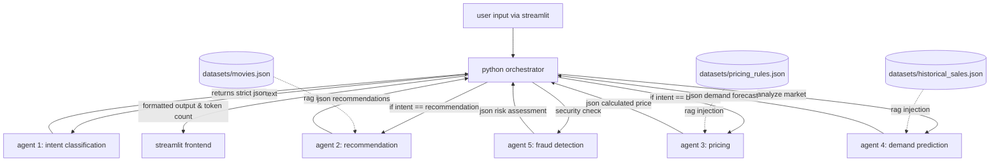

# seshat ai orchestration flow diagram

this document maps the routing logic managed by the python orchestrator, showing how user inputs are parsed by agent 1 and then routed to the specialized agents alongside the local rag datasets.

## flow breakdown

1. user submits query to the python orchestrator.
2. orchestrator passes raw text to agent 1. agent 1 returns a json intent (e.g., "book ticket").
3. orchestrator reads the intent. if booking, it reads the requested movie and passes data to agent 3, agent 4, and agent 5 simultaneously.
4. specific local json datasets are injected into the agent prompts to ensure zero hallucination (rag simulation).
5. the orchestrator collects the json responses from all triggered agents, checks the risk score from agent 5, and delivers the final combined result back to the user interface.

